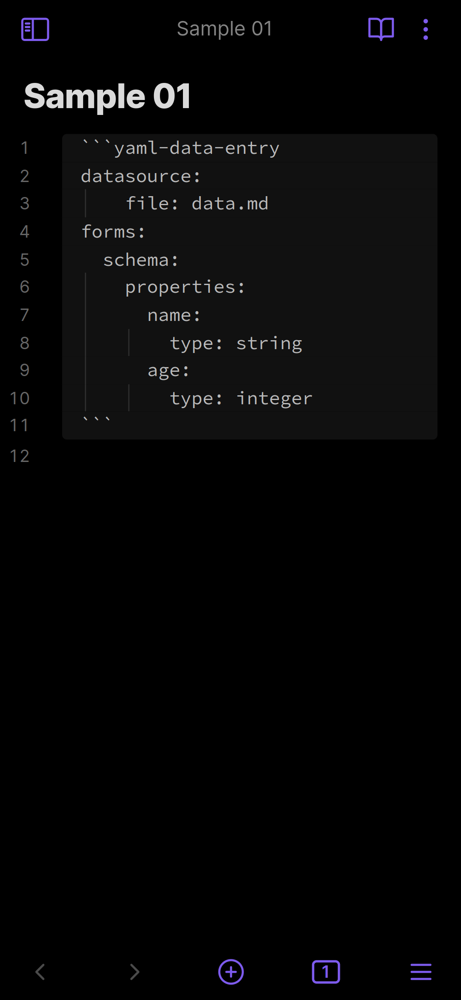
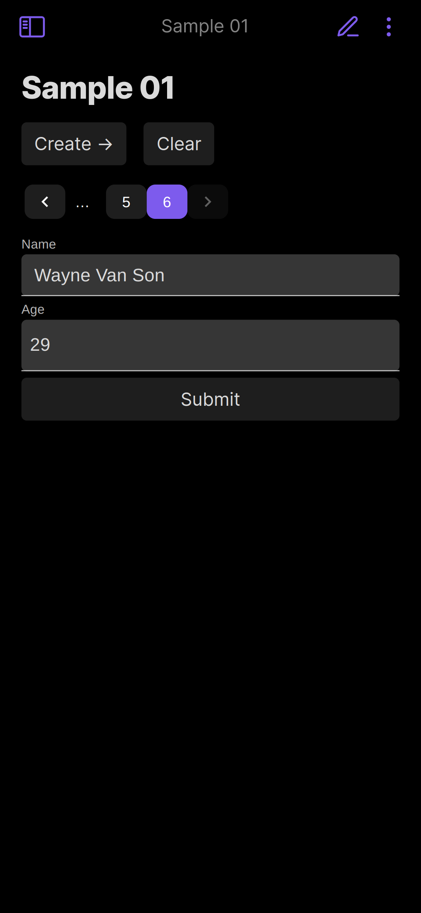
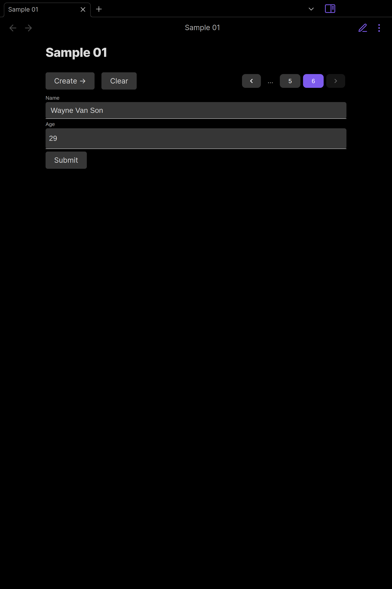
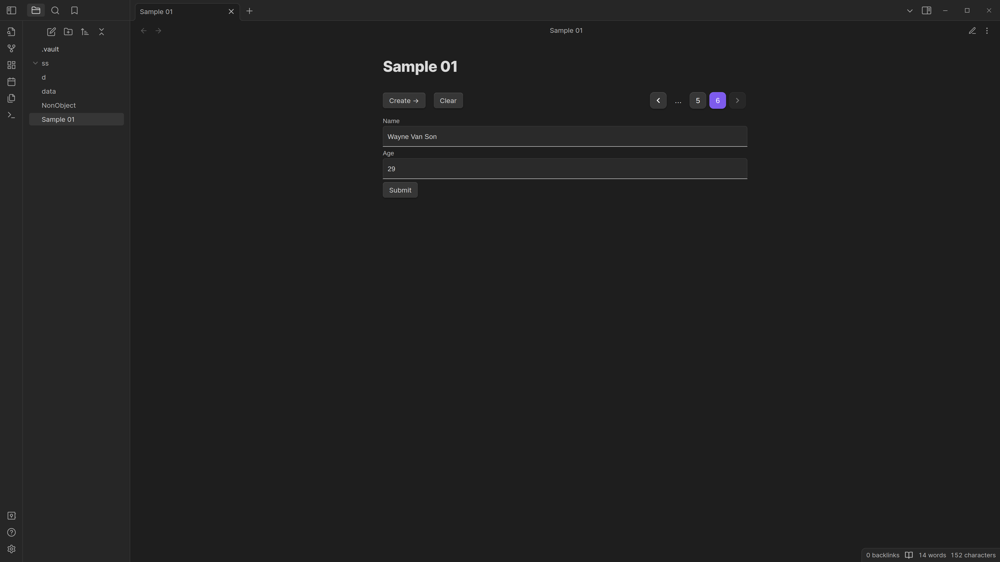

# Data Entry - Obsidian Plugin

An Obsidian.md plugin that turns your metadata into a form.

Feel free to submit issues and discussions with your desires [here on GitHub](https://github.com/waynevanson/data-entry-obsidian-plugin/issues/new).

This is a passion project used to fit my use case, but generalised enough that it could fit yours too. Show you <3 by [supporting this work](https://github.com/sponsors/waynevanson).

CUrrently haven' had a releasedue to big refactor.

## Summary

- Create your datasource (frontmatter metadata within a file)
- Create the schema that represents that datasource using [JSONSCHEMA](https://json-schema.org/specification.html).
- (Optionally) customise how the data is represented as a UI using [JSONFORMS](https://jsonforms.io/docs#how-does-it-work).
- Add a `data-entry` codeblock with the form configuration
- Enter read mode and enjoy a form!

For recent additions to this plugin, please visit the [changelog](https://github.com/waynevanson/data-entry-obsidian-plugin/blob/main/packages/data-entry/CHANGELOG.md)

## Quick Start

Once the plugin is installed from the community store and **enabled**,
Copy the following into a new file and enter read mode.

<pre>
<code>
---
schema:
  type: object
  properties:
    name:
      type: string
    hobbies:
      type: array
      items:
        type: string
---

```data-entry
datasource:
  file:
schema:
  file:
```


</code></pre>

## Please Note

- Although this plugin exists in the obsidian store, it's still a work in progress.
- UI will look janky because Obsidian overrides some styles. Will start working on this soon.
- There's a major bug when editing a schema for a note that is already open. Close the note and reopen it to remove the error. This is next priority.

## Preview

<details>
<summary>Click to open</summary>






</details>

## Configuration

Please visit these links for the definitions of [JSONSCHEMA](https://json-schema.org/specification.html) and [JSONFORMS](https://jsonforms.io/docs#how-does-it-work). JJSONSCHEMA capabilities have been extended with the [following formats](https://ajv.js.org/packages/ajv-formats.html)

The config looks like the typescript interface below:

```typescript
export interface UserConfiguration {
  datasource: {
    file?: {
      path?: string;
      frontmatter?: string;
    };
  };
  schema:
    | {
        file?: {
          path?: string;
          frontmatter?: string;
        };
      }
    | {
        inline: JSONSCHEMA;
      };
  uischema:
    | {
        file?: {
          path?: string;
          frontmatter?: string;
        };
      }
    | {
        inline: UISCHEMA;
      };
}
```

Which will resolve with the following defaults, unless changed in the settings.

```typescript
{
  datasource: {
    file: {
      path: '${CURRENT_FILE}';
      frontmatter: 'data';
    }
  },
  schema:
    file: {
      path: '${CURRENT_FILE}';
      frontmatter: 'schema';
    }
  // actually defaults to null because uischema can be inferred from schema.
  // passing "file" will use the following configuration
  uischema:
    file: {
      path: '${CURRENT_FILE}';
      frontmatter: 'uischema';
    }
}
```

## Developers

Here is some info that we can use.

## How it works

Plugin holds the state of our application.
Config is read into the plugin when a markdown file contains `data-entry`.
We validate this config, inject some defaults and render the UI via react/preact.

We read many files frontmatter contents for the datasource, schema and uischema if we need to.
We use the JSONFORMS react component to render the schema and uischema, keeping track of the data as they fill it in.

### Packages

This repository contains multiple packages to ensure concerns are clearly separated.

- `packages/data-entry` contains the plugin that users install on their devices.
- `packages/obsidian-mocks` contains mocks used to replicate obsidian functionality, as the packages provided by the Obsidian team contains only types and not any implementation for tests.
